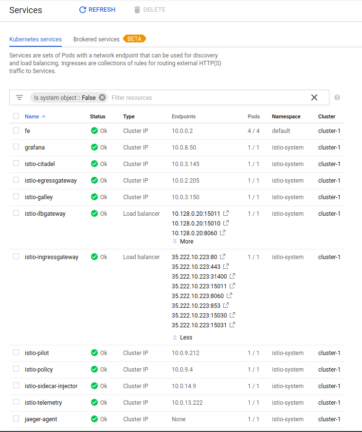
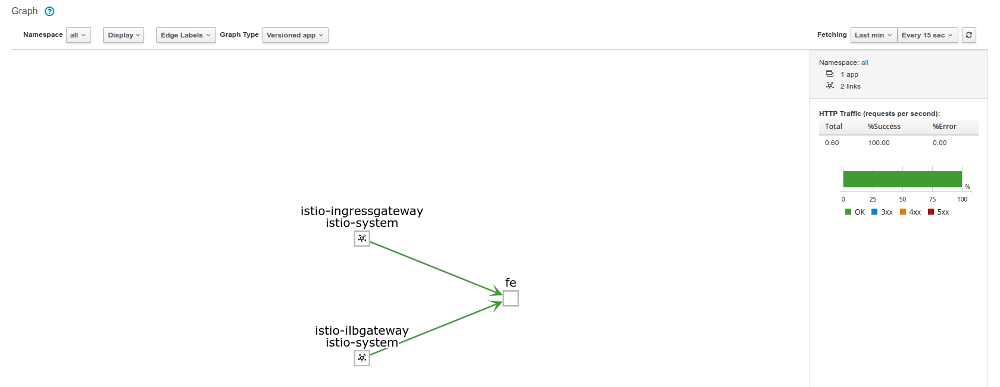

# Istio gRPC Loadbalancing with GCP Internal LoadBalancer (ILB)


Demonstrates gRPC loadbalancing with Istio where mesh-external clients connect via GCP external and internal LoadBalancers:


- `client_grpc_app (on GCEVM) --> (GCP ILB) --> Istio --> Service`

- `client_grpc_app (external) --> (GCP ExternalLB) --> Istio --> Service`


- uses ISTIO version `1.0.5`

1) Install GKE+Istio

Note, in the following i'm installing GKE first and than a manual install of istio.  

You can also simply use
``` --addons HorizontalPodAutoscaling,HttpLoadBalancing,Istio --istio-config auth=MTLS_PERMISSIVE``` as the istio addon for GKE and then add
yaml configs for the ILBGateway


```bash

gcloud container  clusters create cluster-1 --machine-type "n1-standard-4" \
   --zone us-central1-a  --num-nodes 4 --enable-ip-alias 
gcloud container clusters get-credentials cluster-1 --zone us-central1-a

kubectl create clusterrolebinding cluster-admin-binding --clusterrole=cluster-admin --user=$(gcloud config get-value core/account)

kubectl create ns istio-system

export ISTIO_VERSION=1.3.2
wget https://github.com/istio/istio/releases/download/$ISTIO_VERSION/istio-$ISTIO_VERSION-linux.tar.gz
tar xvzf istio-$ISTIO_VERSION-linux.tar.gz

wget https://storage.googleapis.com/kubernetes-helm/helm-v2.11.0-linux-amd64.tar.gz
tar xf helm-v2.11.0-linux-amd64.tar.gz

export PATH=`pwd`/istio-$ISTIO_VERSION/bin:`pwd`/linux-amd64/:$PATH

helm template istio-$ISTIO_VERSION/install/kubernetes/helm/istio-init --name istio-init --namespace istio-system | kubectl apply -f -


helm template istio-$ISTIO_VERSION/install/kubernetes/helm/istio --name istio --namespace istio-system  \
   --set prometheus.enabled=true \
   --set grafana.enabled=true \
   --set tracing.enabled=true \
   --set sidecarInjectorWebhook.enabled=true \
   --set gateways.istio-ilbgateway.enabled=true \
   --set global.mtls.enabled=true > istio.yaml

kubectl apply -f istio.yaml


kubectl label namespace default istio-injection=enabled
```


2) Verify external and ILB IP addresses

```bash
kubectl get svc istio-ingressgateway -n istio-system
export GATEWAY_IP=$(kubectl -n istio-system get service istio-ingressgateway -o jsonpath='{.status.loadBalancer.ingress[0].ip}')
echo $GATEWAY_IP

kubectl get svc istio-ilbgateway  -n istio-system
export ILB_GATEWAY_IP=$(kubectl -n istio-system get service istio-ilbgateway -o jsonpath='{.status.loadBalancer.ingress[0].ip}')
echo $ILB_GATEWAY_IP

```

```
$ kubectl get no,po,rc,svc,ing,deployment -n istio-system
```

3) Deploy sample application

Source code for the sample application is in the `apps/` folder for this repo.

The grpc application creates one gRPC Channel to the server and on that one connection, sends 10 RPC requests.

```
kubectl apply -f fe-certs.yaml

kubectl apply -f all-istio.yaml 

kubectl apply -f istio-fe.yaml \
   -f istio-ilbgateway-service.yaml -f istio-ingress-gateway.yaml \
   -f istio-ingress-ilbgateway.yaml
```




### Verify External client connectivity


```bash
docker  run --add-host grpc.domain.com:$GATEWAY_IP -t salrashid123/grpc_backend /grpc_client --host grpc.domain.com:443
```

You should see responses from different service addresses:

```bash
$ docker  run --add-host grpc.domain.com:$GATEWAY_IP -t salrashid123/grpc_backend /grpc_client --host grpc.domain.com:443
2019/02/07 02:25:32 RPC Response: 0 message:"Hello unary RPC msg   from hostname fe-deployment-64768579c-4p528" 
2019/02/07 02:25:34 RPC Response: 1 message:"Hello unary RPC msg   from hostname fe-deployment-64768579c-626bw" 
2019/02/07 02:25:35 RPC Response: 2 message:"Hello unary RPC msg   from hostname fe-deployment-64768579c-swmk9" 
2019/02/07 02:25:36 RPC Response: 3 message:"Hello unary RPC msg   from hostname fe-deployment-64768579c-7cj7g" 
2019/02/07 02:25:37 RPC Response: 4 message:"Hello unary RPC msg   from hostname fe-deployment-64768579c-4p528" 
```

### Verify Internal client connectivity

First create a GCP VM within the same VPC.  SSH in and run:
  
```bash
  docker  run --add-host grpc.domain.com:$ILB_GATEWAY_IP \
     -t salrashid123/grpc_backend /grpc_client --host grpc.domain.com:443 
```

You should see responses from different service addresses:

```bash
$ docker  run --add-host grpc.domain.com:$ILB_GATEWAY_IP -t salrashid123/grpc_backend /grpc_client --host grpc.domain.com:443
2019/02/07 02:26:05 RPC Response: 0 message:"Hello unary RPC msg   from hostname fe-deployment-64768579c-4p528" 
2019/02/07 02:26:06 RPC Response: 1 message:"Hello unary RPC msg   from hostname fe-deployment-64768579c-626bw" 
2019/02/07 02:26:07 RPC Response: 2 message:"Hello unary RPC msg   from hostname fe-deployment-64768579c-swmk9" 
2019/02/07 02:26:08 RPC Response: 3 message:"Hello unary RPC msg   from hostname fe-deployment-64768579c-7cj7g" 
2019/02/07 02:26:09 RPC Response: 4 message:"Hello unary RPC msg   from hostname fe-deployment-64768579c-4p528"
```

If you deployed and setup `Kiali`, you should see traffic inbound from the ILB and external gateway:



